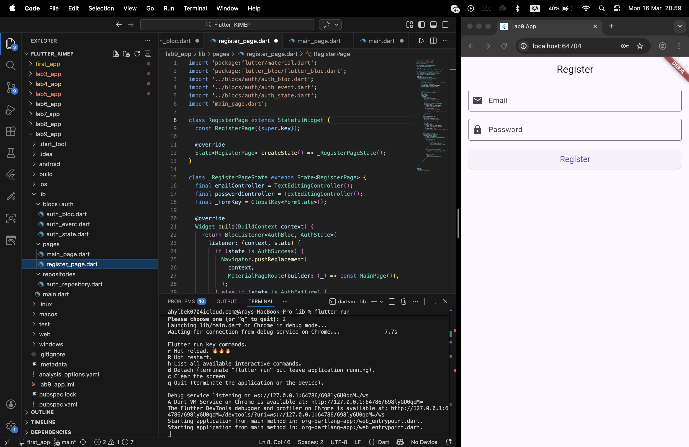

# Lab9 App - Flutter Authentication with BLoC

## 📱 Project Description
Lab9 App is a demonstration Flutter application implementing user authentication using the BLoC (Business Logic Component) pattern. The application shows a registration form with validation and state handling.

## ✨ Features
- Registration form with email and password validation
- Email format validation (must contain @ and correct format)
- Password length validation (minimum 6 characters)
- Loading, success, and error state handling
- Navigation to main screen after successful registration
- Error display via SnackBar

## 🏗 Project Structure
```
lib/
├── blocs/
│   └── auth/
│       ├── auth_bloc.dart      # BLoC for authentication management
│       ├── auth_event.dart      # Events (RegisterEvent)
│       └── auth_state.dart      # States (Initial, Loading, Success, Failure)
├── pages/
│   ├── register_page.dart       # Registration page with form
│   └── main_page.dart           # Main page after login
├── repositories/
│   └── auth_repository.dart     # Repository for authentication operations
└── main.dart                    # Application entry point
```

## 🚀 Technologies Used
- **Flutter** - UI framework
- **flutter_bloc** - State management library
- **BLoC Pattern** - Business Logic Component architecture

## 📋 Prerequisites
- Flutter SDK (version 3.0 or higher)
- Dart SDK (version 3.0 or higher)

## 🔧 Installation

1. Clone the repository:
```bash
git clone <your-repository-url>
cd lab9_app
```

2. Install dependencies:
```bash
flutter pub get
```

3. Run the application:
```bash
flutter run
```

## 📦 Dependencies
Add this to your `pubspec.yaml`:
```yaml
dependencies:
  flutter:
    sdk: flutter
  flutter_bloc: ^8.1.3
```

## 🎮 How to Use

1. **Launch the app** - You'll see the registration screen
2. **Enter your email** - Must contain @ and be in valid format
3. **Enter your password** - Minimum 6 characters
4. **Click Register** - The app will simulate a 2-second registration process
5. **Success** - Automatically navigates to Main Page
6. **Failure** - Error message appears via SnackBar

## 📸 Screenshots

### Registration Screen


*The registration screen with form validation and register button*

## 🔍 Validation Rules

### Email Field:
- ❌ Cannot be empty
- ❌ Must contain @ symbol
- ❌ Must follow valid email format (e.g., name@domain.com)
- ✅ Valid email passes validation

### Password Field:
- ❌ Cannot be empty
- ❌ Minimum 6 characters required
- ✅ Valid password passes validation

## 🧪 Testing the Application

### Test Scenarios:

1. **Empty Fields**
   - Try to register with empty fields
   - Validation errors appear below each field

2. **Invalid Email**
   - Enter "test" as email
   - Error: "Email must contain @"

3. **Invalid Format**
   - Enter "test@" as email
   - Error: "Please enter a valid email"

4. **Short Password**
   - Enter "123" as password
   - Error: "Password must be at least 6 characters"

5. **Successful Registration**
   - Enter valid email (e.g., "user@example.com")
   - Enter valid password (min. 6 characters)
   - Click Register
   - Loading indicator appears for 2 seconds
   - Automatically navigates to Main Page

6. **Registration Failure**
   - Enter "test@test.com" as email (simulated existing user)
   - Enter any password
   - Shows SnackBar with "Registration failed" message

## 📊 Application States

The BLoC manages 4 different states:

| State | Description | Visual Indicator |
|-------|-------------|------------------|
| `AuthInitial` | Initial state | Registration form |
| `AuthLoading` | Processing registration | Circular progress indicator |
| `AuthSuccess` | Registration successful | Navigation to Main Page |
| `AuthFailure` | Registration failed | SnackBar with error message |

## 🔄 Data Flow

1. **User Action** → User fills form and clicks Register
2. **Validation** → Form validates input data
3. **Event Dispatch** → `RegisterEvent` is sent to BLoC
4. **State Change** → BLoC emits `AuthLoading` state
5. **Repository Call** → `AuthRepository.register()` simulates API call
6. **Result Processing** → BLoC emits `AuthSuccess` or `AuthFailure`
7. **UI Update** → Listener reacts to state changes (navigation or SnackBar)

## 👨‍💻 Author
Aray Akhylbek

## 📄 License
This project is for educational purposes as part of Lab 9 assignment.

## 🎓 Educational Objectives
- Understanding BLoC pattern implementation
- Form validation in Flutter
- State management with flutter_bloc
- Navigation between screens
- Error handling with SnackBar